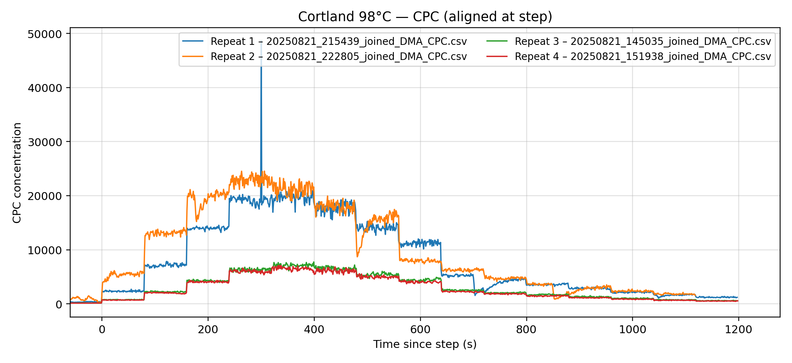
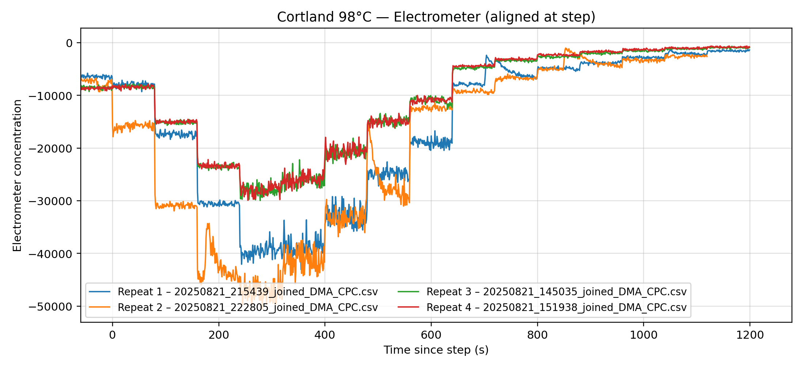
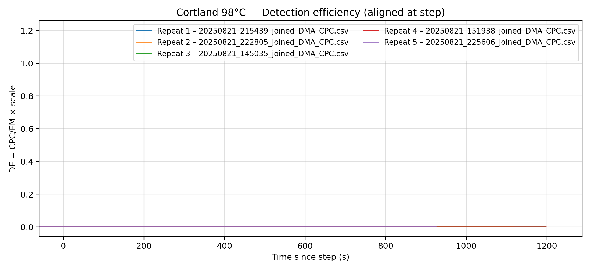
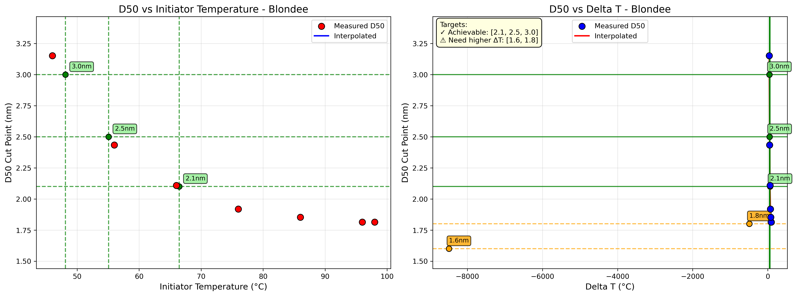

# CPC Electrometer Calibration

Code for calibrating condensation particle counters (CPCs) against an electrometer reference. The workflow compares CPC concentration measurements to electrometer/DMA measurements, computes detection-efficiency curves, fits those curves, and estimates D50 cut points from the fitted response.

Raw calibration data are not included in this repository. The example images in `examples/plots/` show representative outputs only.

## Calibration Idea

The electrometer is used as the reference concentration measurement. During a calibration run, the DMA selects particle mobility/size conditions while both the electrometer and the CPC measure the aerosol stream. The CPC detection efficiency at each condition is calculated as:

```text
detection efficiency = CPC concentration / electrometer concentration
```

Those efficiencies are plotted against DMA voltage or converted mobility diameter. The code then fits an activation curve with a Gormley-Kennedy transmission correction and extracts D50, the particle diameter where the fitted curve reaches 50% of its fitted maximum efficiency.

## Repository Contents

- `run_filemerge.py`: merges electrometer/DMA and CPC time series on timestamp, keeping all electrometer rows and adding nearest CPC values.
- `detectionefficiency.py`: converts merged files into averaged detection-efficiency tables and basic plots.
- `run_detecteff.py`: batch workflow for multiple CPC operating temperatures, curve fitting, combined detection-efficiency plots, fit parameter output, and run reports.
- `fitfunc.py`: activation, sigmoid, and Gormley-Kennedy fitting functions.
- `d50_temp.py`: estimates D50 versus initiator temperature or Delta T from fitted detection-efficiency curves.
- `repeats_comparison.py`: compares repeated calibration runs by overlaying aligned CPC and electrometer time series.
- `inst_param.py`: column names, instrument read settings, and fit bounds.

## Example Plots

Aligned CPC response:



Aligned electrometer reference:



Detection-efficiency time series comparison:



D50 target analysis:



## Install

```powershell
python -m venv .venv
.\.venv\Scripts\Activate.ps1
python -m pip install -r requirements.txt
```

## Typical Workflow

1. Merge electrometer/DMA and CPC files:

```powershell
python run_filemerge.py
```

The script opens file pickers for the electrometer/DMA file and CPC log. It writes a joined file with `elec_*` and `cpc_*` columns.

2. Calculate detection efficiency and fit curves:

```powershell
python run_detecteff.py
```

Edit the run settings near the top of `run_detecteff.py` for the CPC name, initiator temperatures, THAB monomer/trimer voltages, and row-skipping window. The script reads joined files, calculates CPC/electrometer detection efficiency, fits each curve, and writes combined fit and detection-efficiency outputs next to the selected data.

3. Estimate D50 settings from the fitted curves:

```powershell
python d50_temp.py --data-dir results --file-date 20250826 --cpc Earligold --conditioner-temp 10 --temperatures 98 91 81 71 61 51 41
```

This reads files named like `20250826_detect_eff_Earligold.csv` and `20250826_fits_Earligold.csv`, then plots D50 versus initiator temperature and Delta T.

4. Compare repeated runs:

```powershell
python repeats_comparison.py
```

This GUI-assisted script selects repeated joined files for each temperature and produces aligned CPC/electrometer overlays.

## Data Policy

Do not commit raw calibration files or generated CSV/TXT reports. The `.gitignore` intentionally excludes raw data, joined files, detection-efficiency CSVs, fit CSVs, report text files, and generated graph folders. If you need to share a result, add a curated PNG under `examples/plots/`.

## Authors

- Ziheng Zeng
- Darren Cheng

## License

MIT License. See `LICENSE`.

